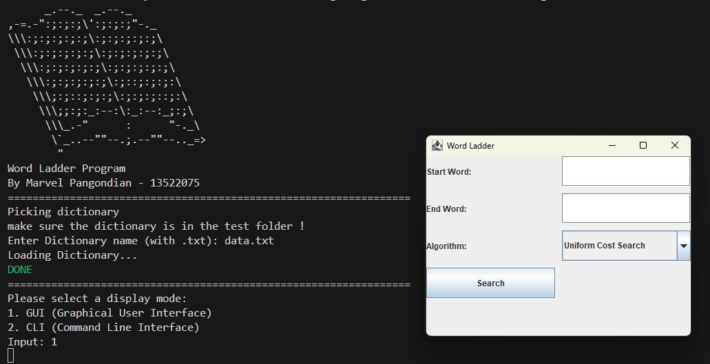

# Tugas kecil 3 Strategi Algoritma
> Program sederhana untuk menyelesaikan permainan *Word Ladder*

## Daftar Isi
- [title](#title)
  - [Daftar Isi](#daftar-isi)
  - [Sistematika File](#sistematika-file)
  - [Deskripsi Program](#deskripsi-program)
  - [Requirements](#requirements)
  - [Menjalankan Program](#menjalankan-program)
  - [Status Proyek](#status-proyek)
  - [Identitas Pembuat Program](#identitas-pembuat-program)

<!-- * [License](#license) -->
## Sistematika File
```
├─── bin
│       └─── placeholder.txt
│
├─── doc
│       ├─── Spesifikasi Tugas Kecil 3 Stima 2023_2024.pdf
│       └─── Tucil3_13522075.pdf
│
├─── img
│       ├─── img1.png
│       └─── img2.png
│
├─── src
│       └─── main
│                ├─── algorithm
│                ├─── cli
│                ├─── customexception
│                ├─── datastructure
│                ├─── dictionary
│                ├─── gui
│                ├─── prompt
│                ├─── util
│                └─── Main.java
│
├─── test
│       ├─── data.txt
│       ├─── oracleDict.txt
│       ├─── Picture1.png
│       ├─── Picture2.png
│       ├─── Picture3.png
│       ├─── Picture4.png
│       ├─── Picture5.png
│       └─── Picture6.png
│
├─── .gitignore
├─── LICENSE
├─── README.md
├─── run.bat
└─── run.sh
```

## Deskripsi Program
Program untuk mencari rangkaian kata dalam permainan *Word Ladder* menggunakan algoritma *Uniform Cost Search*, *Greedy Best First Search*, dan A*. *Word Ladder* adalah permainan untuk mencari rangkaian kata dari kata awal menuju ke kata akhir, sebagai contoh : *roll -> rool -> room* dimana kata *roll* adalah kata pertama dan kata *room* adalah kata tujuan. Kata dalam rangkaian kata harus memiliki jumlah huruf yang sama serta hanya diperbolehkan satu huruf berbeda antara sebuah kata dengan kata sebelumnya 
Program mampu menerima kamus yang akan digunakan dalam bentu file *.txt* pada folder *test*. Dengan kamus tersebut, program dapat mencari rangkaian kata antara kata pertama dan kata tujuan dari masukan pengguna.

## Requirements
* Java version 21 
* Java Swing, tedapat pada *Java Development Kit ([JDK](https://www.oracle.com/java/technologies/downloads/#java21))*

## Menjalankan Program
Pada *windows powershell*, pastikan berada pada *root directory* lalu jalankan run.bat

```
./run.bat
```
pada *ubuntu(WSL), pastikan berada pada root directory lalu jalankan :
```
chmod +x run.sh
./run.sh
```
kedua cara di atas akan otomatis menghasilkan dan menjalankan executable file. Berikut adalah tampiilan program utama :
```
      _.--._  _.--._
,-=.-":;:;:;\':;:;:;"-._
\\\:;:;:;:;:;\:;:;:;:;:;\
 \\\:;:;:;:;:;\:;:;:;:;:;\
  \\\:;:;:;:;:;\:;:;:;:;:;\
   \\\:;:;:;:;:;\:;::;:;:;:\
    \\\;:;::;:;:;\:;:;:;::;:\
     \\\;;:;:_:--:\:_:--:_;:;\
      \\\_.-"      :      "-._\
       \`_..--""--.;.--""--.._=>
        "
Word Ladder Program
By Marvel Pangondian - 13522075
=================================================================
Picking dictionary
make sure the dictionary is in the test folder !
Enter Dictionary name (with .txt):
```
Pengguna dapat memasukan kamus yang ingin digunakan dalam *folder test*. Pastikan kamus dalam bentuk file *.txt*. Kamus buatan penulis sudah disediakan dalam *folder test* dengan nama *data.txt*. Berikut contoh menggunakan kamus buatan penulis : 

```
      _.--._  _.--._
,-=.-":;:;:;\':;:;:;"-._
\\\:;:;:;:;:;\:;:;:;:;:;\
 \\\:;:;:;:;:;\:;:;:;:;:;\
  \\\:;:;:;:;:;\:;:;:;:;:;\
   \\\:;:;:;:;:;\:;::;:;:;:\
    \\\;:;::;:;:;\:;:;:;::;:\
     \\\;;:;:_:--:\:_:--:_;:;\
      \\\_.-"      :      "-._\
       \`_..--""--.;.--""--.._=>
        "
Word Ladder Program
By Marvel Pangondian - 13522075
=================================================================
Picking dictionary
make sure the dictionary is in the test folder !
Enter Dictionary name (with .txt): data.txt
Loading Dictionary...
DONE
=================================================================
Please select a display mode:
1. GUI (Graphical User Interface)
2. CLI (Command Line Interface)
Input: 

```
Penulis memiliki dua pilihan tampilan, yakni tampilan dalam CLI (*Command Line Interface*) atau GUI (*Graphical User Interface*).</br></br>

Berikut Contoh alur program dalam CLI : </br>
```
=================================================================
Please select a display mode:
1. GUI (Graphical User Interface)
2. CLI (Command Line Interface)
Input: 2
=================================================================
Main Menu
Enter Start Word: love
Enter End Word: life

Pick algorithm to use 
1. Uniform Cost Search Algorithm 
2. Greedy Best-First Search Algorithm 
3. A-Star Search Algorithm 
Input: 1

Word path : 
-> 1. love
-> 2. live
-> 3. life
g(n) = 2
Time taken : 3.622700 ms
Nodes traversed : 19
Nodes generated : 363
Length of Path : 3

Do you want to continue ? (-1 for no, any number for yes):
```
pengguna dapat mengakhiri program dengan masukan (-1) saat pertanyaan *Do you want to continue ?*

Berikut Contoh alur program dalam GUI : </br>
<br/>

Pengguna dapat memasukan kata awal pada *text box Start Word* dan kata tujuan pada *text box End Word*<br/>


## Status Proyek
Status : *Completed*
| Poin  | Ya | Tidak |
|---|---|---|
| Program berhasil dijalankan | ✓ |   |
| Program dapat menemukan rangkaian kata dari start word ke end word sesuai aturan permainan dengan algoritma UCS | ✓ |   |
| Solusi yang diberikan pada algoritma UCS optimal | ✓ |   |
| Program dapat menemukan rangkaian kata dari start word ke end word sesuai aturan permainan dengan algoritma Greedy Best First Search | ✓ |  |
| Program dapat menemukan rangkaian kata dari start word ke end word sesuai aturan permainan dengan algoritma A*| ✓ |  |
| Solusi yang diberikan pada algoritma A* optimal | ✓ |  |
| (Bonus) Program memiliki tampilan GUI | ✓ |    |

## Identitas Pembuat Program
Nama : Marvel Pangondian </br>
NIM : 13522075 </br>
Program Studi : Teknik Informatika </br>
Profile Github : [MarvelPangondian](https://github.com/MarvelPangondian)
<!-- Optional -->
<!-- ## License -->
<!-- This project is open source and available under the [... License](). -->

<!-- You don't have to include all sections - just the one's relevant to your project -->
